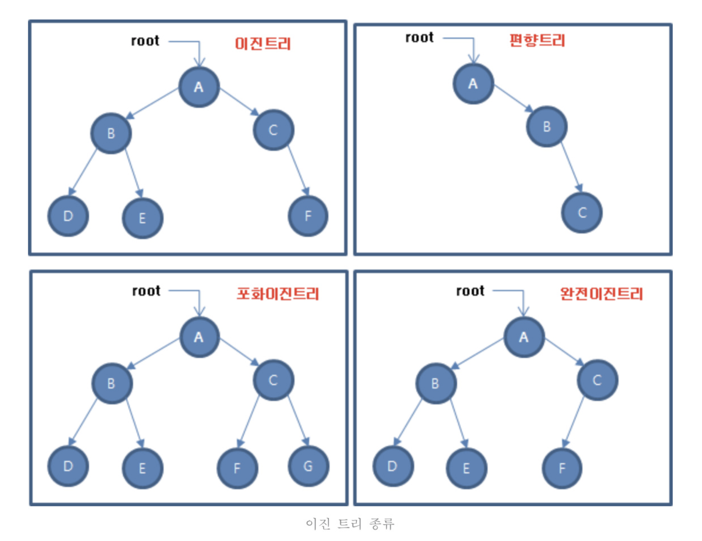
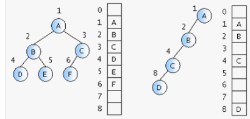
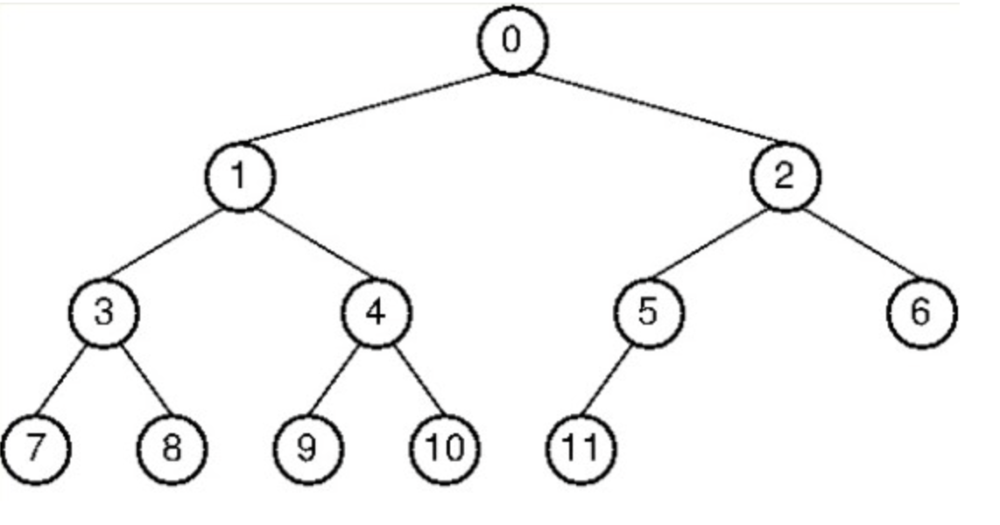

# Binary Tree (이진 트리)

`이진 트리는 각 노드의 자식 노드(차수)의 개수가 2 이하로 구성돼 있는 트리를 말한다. 트리 영역에서
가장 많이 사용되는 형태이다.`

## 이진 트리의 핵심 이론

### 이진 트리의 종류
- 이진 트리에는 편향 이진 트리, 포화 이진 트리, 완전 이진 트리가 있다.
- 편향 이진 트리는 노드들이 한쪽으로 편향돼 생성된 이진트리
- 포화 이진 트리는 트리의 높이가 모두 일정하며 리프 노드가 꽉찬 이진 트리
- 완전 이진 트리는 마지막 레벨을 제외하고 완전하게 노드들이 채워져 있고, 마지막 레벨은 왼쪽부터 채워진 트리

### 이진 트리의 순차 표현

- 가장 직관적이면서 편리한 트리 자료구조 형태는 바로 `배열`이다.
- 이진 트리는 위와 같이 1차원 배열의 형태로 표현할 수 있다.
- 이진 트리를 이렇게 1차원 배열로 나타낼때 다음 표와 같은 배열과 인덱스 간의 상관 관계로 
쉽게 나타낼 수 있다.

| 이동 목표 노드  |       인덱스 연산        |  제약 조건(N = 노드 개수)  |
|:---------:|:-------------------:|:------------------:|
|   루트 노드   |      index = 1      |                    |
|   부모 노드   |   index = index/2   |  현재 노드가 루트 노드가 아님  |
| 왼쪽 자식 노드  |   index = index*2   |   index * 2 <= N   |
| 오른쪽 자식 노드 | index = index*2 + 1 | index * 2 + 1 <= N |

> 위의 인덱스 연산 방식은 향후 세그먼트 트리(segment)나 LCA(lowest common ancestor)
> 알고리즘에서도 기본이 되는 연산이므로 꼭 숙지해야함

### 이진 트리의 순회
- 전위 순회(preorder traverse) : 뿌리 -> 왼쪽 자식 -> 오른쪽 자식, DFS의 한 형태
- 중위 순회(inorder traverse) : 왼쪽 자식 -> 뿌리 -> 오른쪽 자식
- 후위 순회(postorder traverse) : 왼쪽 자식 -> 오른쪽 자식 -> 뿌리
- 층별 순회(level order traverse) : 위 쪽 node들 부터 아래방향으로 차례로 방문, BFS의 한 형태

- 예제

- preorder : 0 1 3 7 8 4 9 10 2 5 11 6
- inorder : 7 3 8 1 9 4 10 0 11 5 2 6
- postorder : 7 8 3 9 10 4 1 11 5 6 2 0
- level order : 0 1 2 3 4 5 6 7 8 9 10 11
